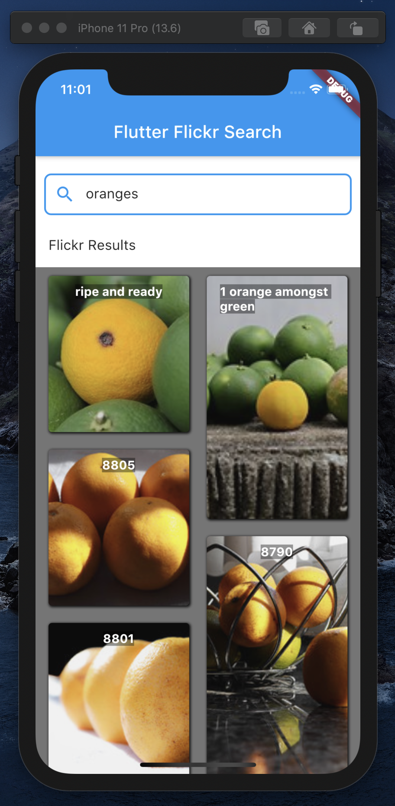

# Flutter Search with Flickr

Prepare to surf all the images that Flickr has to offer.
* Beware: disturbing images may appear while searching...

## Description:
This search allows users to search tags or titles of images from Flickr's public api.

## AC Completed 
- Make the call to the web service in a way that does not block the UI. 
- The user interface must remain responsive to touch during the call and while the images are downloaded asynchronously into the list. 
- Results will be displayed in a list that shows one row/cell per record with each row containing at least image, title, width and height. 

## AC To Do
- When a user clicks on an image, show a detail page containing metadata about the image (the image URL, title, or whatever is available). 
- For accessibility purposes, give selectable images the button trait so that they are announced as such. Also announce nav titles as the pages are navigated to.

## Technologies:
- Flutter
- Dart

| Gif           | Snapshot           |
| ------------- |:-------------:|
|  |  |

